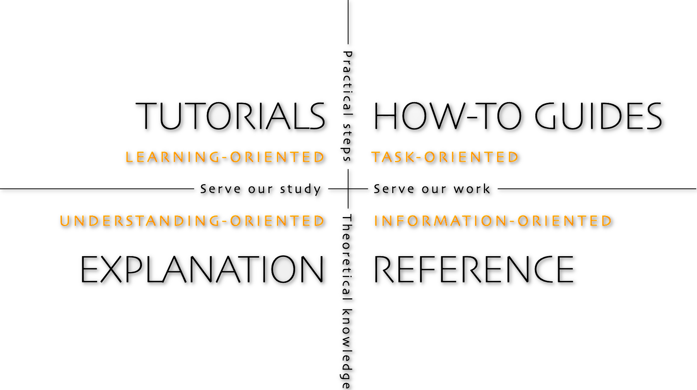
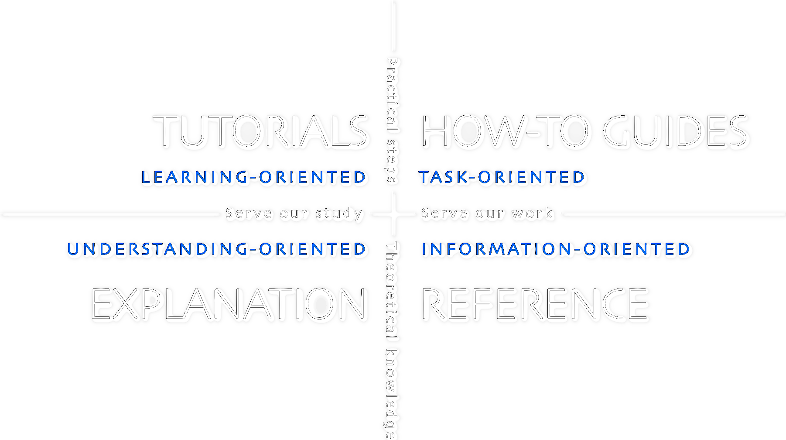

===========================================
Effective Documentation: Diátaxis Framework
===========================================

Documentation serves as the backbone for the sustainability and maintainability
of any software project. It provides indispensable support for developers,
users, and stakeholders alike.

People visit documentation for four main reasons:

- to learn, via tutorials
- to accomplish a task, via how-to guides
- to understand, via explanations
- for information, via references

This document serves as an example of the "Explanation" mode within the
`Diátaxis Framework <https://diataxis.fr/>`_, aimed at providing a high-level
overview to facilitate understanding.

Why Documentation Matters
-------------------------

Guido van Rossum, the creator of Python, captures the essence of documentation
when he states, "Code is more often read than written." In essence,
inadequately documented code becomes an obstacle for understanding and
maintaining, even for those who originally authored the code.

Similarly, Jeff Atwood, the founder of Coding Horror, has articulated that
"Code tells you how; Comments tell you why." Documentation serves as an
annotated guidebook, offering context, and clarification for code. It helps
developers understand not just the 'how', but the 'why' and 'what for', thus
aiding the code’s purpose, functionality, and usage.

Moreover, as Daniele Procida, the author of "Documentation: An Introduction for
Technical Writers and Engineers," warns, "No matter how good your software is,
poor documentation could deter users from using it." The quality of
documentation often mirrors the user adoption and the success of a software
project.

In essence, effective documentation is paramount for a codebase to be
maintainable, easily understandable, and widely adopted.

Diátaxis Framework
------------------

Introduction
^^^^^^^^^^^^

The Diátaxis Framework offers a systematic approach to authoring technical
documentation. It outlines four distinct modes of documentation to cover the
varied needs of the user.

Four Documentation Modes
^^^^^^^^^^^^^^^^^^^^^^^^

1. **Tutorials**: Primarily learning-oriented, these are step-by-step guides
    that help new users learn a software product from scratch.
2. **How-To Guides**: These are problem-oriented documents that offer solutions
    to specific issues or challenges.
3. **Reference**: Information-oriented, this is where the technical details
    lie—API specifications, environment variables, and so on.
4. **Explanation**: Designed to be understanding-oriented, these documents
    provide context and a higher-level view of the code or technology.

Origins and Philosophy
^^^^^^^^^^^^^^^^^^^^^^

The term 'Diátaxis' originates from Greek, combining "dia" (across) with
"taxis" (arrangement). The framework stresses a hierarchical approach to
organize and represent information, creating a coherent structure by
understanding the relationships between different modes of documentation.

Essential Components
^^^^^^^^^^^^^^^^^^^^^

- **Content**: Ensure the content is accurate, concise, and easy to digest.
    This includes text, images, diagrams, and code examples.
- **Navigation**: Implement intuitive pathways like a table of contents,
    search functionalities, and hyperlinks, so users can easily find what they
    are looking for.
- **Presentation**: Employ a clean, consistent visual design focusing on
    readability and usability.

.. note::
   The document you're reading serves as an example of the "Explanation" mode
   within the Diátaxis framework, aimed at providing a high-level overview to
   facilitate understanding.

Further Reading
---------------

To delve deeper into the Diátaxis Framework and its methodologies, visit the
`Diátaxis Framework website <https://diataxis.fr/>`_.
