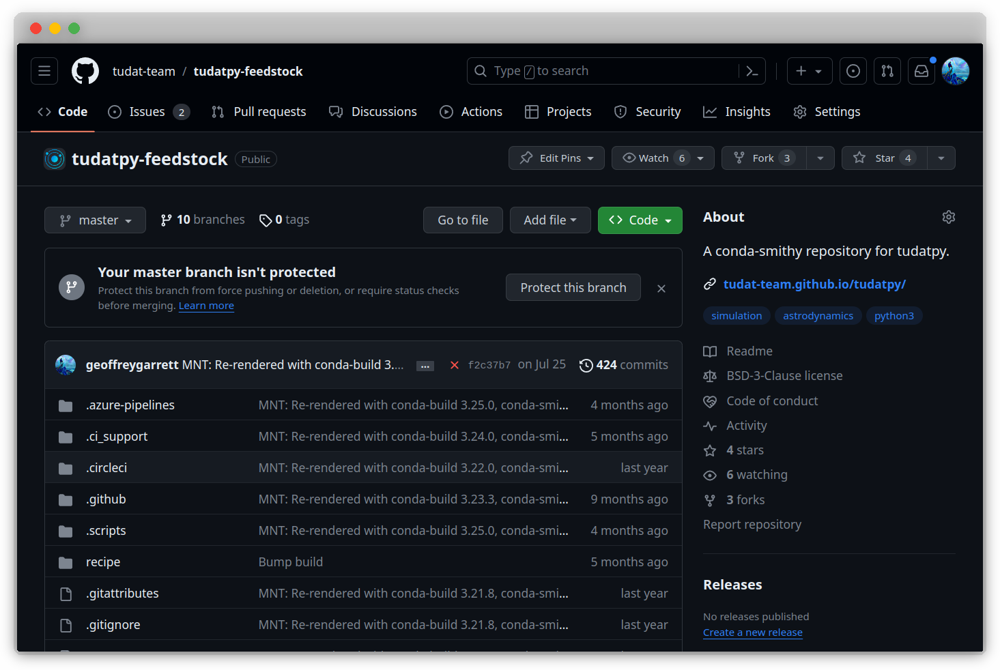

=======================
DevOps Primer for Tudat
=======================

This guide serves as an introduction to :term:`DevOps` concepts and tools for
the Tudat project. It's aimed at developers and users new to :term:`DevOps`,
offering a basic understanding of essential tools and practices in the
development operations process.

Feedstocks
==========

.. _Conda-smithy: https://github.com/conda-forge/conda-smithy
.. _Anaconda Cloud: https://anaconda.org/

`Conda-smithy`_ is a tool for creating and maintaining conda packages, and is
maintained by the `conda-forge <https://conda-forge.org/>`_ community. It
automates the process of creating and maintaining a feedstock repository for a
package, which can then be used to build and upload the package to `Anaconda
Cloud`_. Packages on `Anaconda Cloud`_ can then be installed using ``conda
install``. For all repositories discussed in the `GitHub in the Tudat Ecosystem
<github-in-the-tudat-ecosystem.html>`_ section, there is a corresponding feedstock repository on the
`Tudat Team <https://github.com/tudat-team>`_ organization on GitHub. For
example, the feedstock repository for the tudatpy package is found as
`tudatpy-feedstock <https://github.com/tudat-team/tudatpy-feedstock>`_, as seen
in the following screenshot.

The primary purpose of feedstock repositories is to build and upload packages
to `Anaconda Cloud`_. The feedstock repository contains a recipe for building
the package, which is used by `Conda-smithy`_ to build the package for different
platforms. The relevant components of a feedstock repository are detailed in
the following table.

.. list-table::
   :header-rows: 1
   :widths: 35 65

   * - File/Folder
     - Description
   * - ``meta.yaml``
     - Contains metadata for the package, used by `Conda-smithy`_ to create the recipe for building the package.
   * - ``conda-forge/``
     - Folder created by `Conda-smithy`, containing the recipe for building the package.
   * - ``recipe/``
     - Contains the recipe for building the package; a folder created by `Conda-smithy`_.
   * - ``.ci_support/``
     - Contains CI/CD configuration files for the package, created by `Conda-smithy`_.
   * - ``.github/``
     - Contains GitHub configuration files for the package, created by `Conda-smithy`_.

Feedstock Automation 🔧
^^^^^^^^^^^^^^^^^^^^^^^

The following mechanism is maintained by `Conda-forge`_ to build and upload
packages to `Anaconda Cloud`_. It is defined in the ``.github/workflows/``
folder of the feedstock repository. The ``.github/workflows/`` folder contains

.. mermaid:: /assets/mermaid/devops/devops-a.mmd
   :light-theme: light
   :dark-theme: dark

.. note::

        The feedstock repository is automatically created by `Conda-smithy`_ when
        the package is uploaded to `Anaconda Cloud`_. The feedstock repository
        contains a recipe for building the package, which is used by `Conda-smithy`_
        to build the package for different platforms. The feedstock repository also
        contains a ``meta.yaml`` file, which contains the metadata for the package.
        This file is used by `Conda-smithy`_ to create the recipe for building the
        package.

Environment Variables
=====================

`Environment Variables <environment-variables.html>`_ are crucial for storing
configuration settings and other data. This section covers setting environment
variables in different operating systems and in Python.

Access Tokens
=============

`Access Tokens <access-tokens.html>`_ are essential for secure authentication.
Learn about generating and managing access tokens for various services, and
setting environment variables for these tokens.

Version Control
===============

`Version Control <code-collaboration.html>`_ is vital for managing changes in
the codebase. This part provides an overview of Git and the essentials of
repository management, commits, and collaborative features like pull requests.

Continuous Integration and Deployment
=====================================

`Continuous Integration and Deployment <continuous-deployment.html>`_
streamlines development processes. This section delves into setting up CI/CD
pipelines, automated testing, and deployment practices.

.. todo::

    - Expand on setting up environment variables in CI/CD pipelines.
    - Include a case study on integrating Git with CI/CD tools.
    - Discuss secure management of access tokens in automated systems.

Conclusion
==========

The :term:`DevOps` Primer covers the fundamentals of environment variables,
access tokens, version control, and CI/CD in software development. It
emphasizes secure, efficient, and streamlined development practices, integral
to modern software engineering.

.. mermaid:: /assets/mermaid/devops/devops.mmd
   :light-theme: light
   :dark-theme: dark

.. todo::

    - Add links to advanced tutorials and workshops.
    - Include interviews with :term:`DevOps` experts discussing best practices.
    - Consider a section on :term:`DevOps` in cloud computing environments.

.. todo::

    - Add Azure operations related to Conda-forge feedstocks.
    - Describe what happens when a feedstock is pushed to a repository:
        * What is triggered on Azure?
        * What are the relevant files?
        * What is the process? (Include a diagram)
        * Link to `Conda-smithy` documentation.
